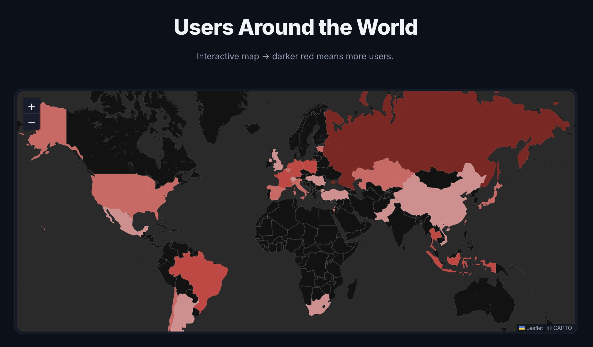
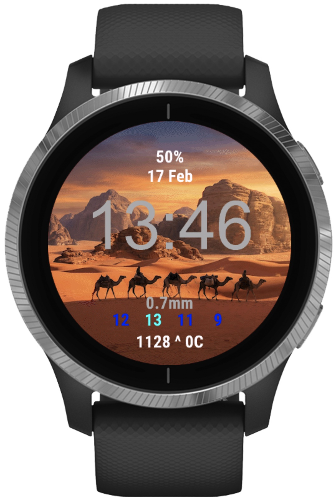
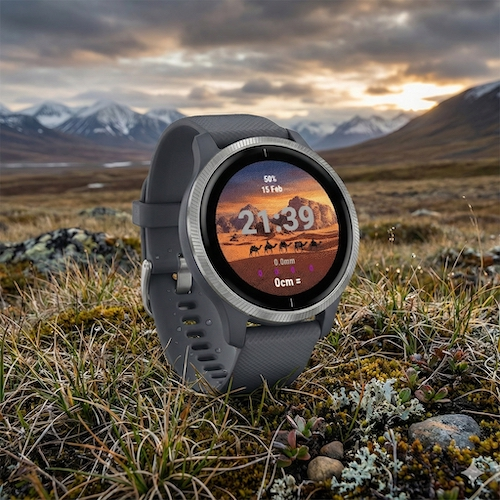

# Nijmegen Watersport Interface (NWI)

This is a custom Garmin Connect watch face built for rowers and water sports enthusiasts in Nijmegen. It provides real-time, hyper-local environmental data directly on your wrist, helping you decide if it's nice to hit the water.
See how many people are gladly using the watchface, and other statistics: https://rowing-nijmegen.duckdns.org/


# Why this exists

Generic weather apps don't cut it for rowing in Nijmegen. We need to know:

1. Is the wind manageable (in combination with the water level)?
2. Is the water level good (I.E. no dike overflown or too low) ?
3. Should I wear my sunglasses? 
4. Will it be foggy in an hour?

This watch face solves that by pulling data from the best local sources available, not generic global models!

Safety Warning:
This watch face monitors the water level at Lobith. When the water level exceeds 1265cm, the Spiegelwaal begins to overflow/inundate. At this level, currents become unpredictable and rowing on the Spiegelwaal is considered unsafe, as the Spiegelwaal effectively becomes one with the Waal river where we do not row on.

## Explanation of the watchface:
The display is designed to be easily readable:
* Top: Battery % and Date.
* Center: Time (Big and clear).
* Bottom Dashboard:
* Wind Timeline: Color-coded wind speed (Knots) for Now, +1h, +2h, and Tomorrow Morning (09:00).

### Wind Color Guide
| Color | Meaning |
| --- | --- |
| **Purple** | Windless / Chill |
| **Blue** | Decent |
| **Green** | Bad |
| **Yellow** | Storm |
| **Red** | Stay Inside |

^^ the rowing experience also depends on the water height, a higher water level = a worse experience since the winds are not stopped by the dikes.


* Precipitation: Expected rainfall for the next 2 hours (mm).
Water Level: Current height at Lobith (cm) with a trend indicator (`^` rising, `v` falling) compared to tomorrow's forecast.


Status Indicators: "SUN" or "FOG" alerts based on visibility and cloud cover. currently sun and fog detection is not the best :( 



Screenshot of analytics webpage viewable at: https://rowing-nijmegen.duckdns.org 

# Server Architecture & Web Dashboard

To provide a robust backend, usage tracking, and a web interface, this project runs on a dedicated server. The data is fetched at regular intervals and securely served over HTTPS to the Garmin watches.

The stack consists of three main components:

* **Frontend:** A modern, interactive web dashboard served via Nginx. It displays total user counts, daily user activity charts, and an interactive world map of active users by country.
* **Backend:** A Python Flask API that handles incoming watch face requests over HTTPS, logs anonymized usage data (with location detection), manages user suggestions, and serves the latest weather/water `data.json`.
* **Analytics Server / Scheduler (`scheduler.py`):** A custom background Python loop that fetches new data every 15 minutes. It queries the high-resolution KNMI Harmonie Arome model via [Open-Meteo]() for local Dutch weather, and the Rijkswaterstaat API for precise water heights at the "Lobith" station. It also systematically processes the collected user data into daily analytics reports.

**How the Watch Connects:**
Your Garmin watch connects to your phone via Bluetooth, downloads the JSON file from the backend server every hour via an HTTPS GET request, and stores it in its memory. The watch face then parses and immediately updates the display based on this real-time info.



### Quick Deployment with Docker

The entire server stack (Nginx frontend, Flask backend, and the Python scheduler) is fully containerized. You can run it on any machine without touching the host OS. To deploy the server, simply navigate to the repository folder and run:

```bash
sudo docker compose up -d
```

This command automatically pulls dependencies and spins up the three containers for you. All data (like `data.json`, user analytics, and the suggestions database) is safely mounted via volumes to your host machine so it persists. For more details, see the [Docker Setup Guide](docker_setup.md).

# Build & Install guide for the actual watchface
Want to modify the code, add custom features or another background image? Do this!

### 1. Prerequisites

You need a few tools installed on your computer:

* Visual Studio Code
* Java Development Kit: Required for the Garmin compiler. (JDK 17 or 11 work).
* Garmin Connect IQ SDK Manager: 
* Open the SDK Manager, log in, and download the latest "Connect IQ SDK" and the device definitions for your specific watch.*

### 2. Setup VSC 

1. Open VS Code
2. Go to the Extensions tab
3. Search for and install Monkey C (by Garmin)
4. Open this repository folder in VS Code

### 3. Build & Run (Simulator) 
1. Press `Ctrl+Shift+P` (or `Cmd+Shift+P` on Mac) and type `Monkey C: Build Current Project`.
2. Select your watch model.
3. Once built, go to the "Run and Debug" tab on the left and press the green "Play" button.
4. The simulator window should pop up.
* To test the data fetching, go to Simulation > Trigger Background Scheduled Event in the simulator menu, this forces the watch to download the `data.json` file.


### 4. Using real hardware 

To get this on your actual wrist without publishing to the store:

1. Connect your Garmin watch to your computer via USB
2. In VS Code, run `Monkey C: Build for Device`
3. Select your specific watch model
4. This creates a `.prg` file in the `bin/` folder of the project
5. Drag and drop that `.prg` file into the `GARMIN/APPS/` folder on your watch's storage drive
6. Disconnect safely. The watch face should now be available in your watch's menu
> **Hardware Note:** If you are on a Mac and it doesn't recognize your watch as a drive, try using a Windows machine or a different cable. (My MacBook wouldn't recognize it, but my Dell worked fine).

### To-do list: 
* [ ] Improve the fog and sun detection logic.


### Contact
For questions or anything else, please reach out to me: **ruben.vlieger@ru.nl**


